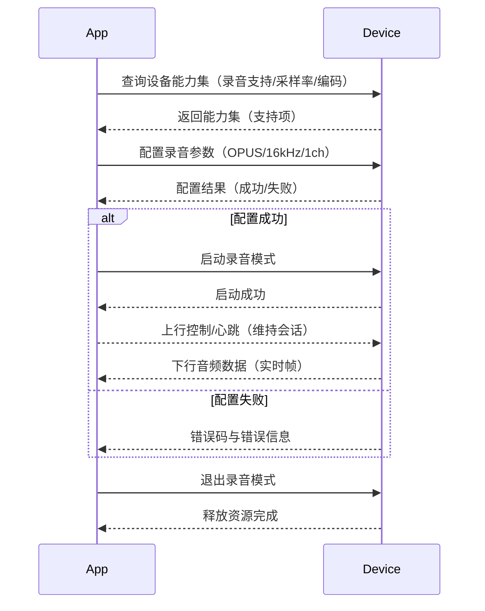
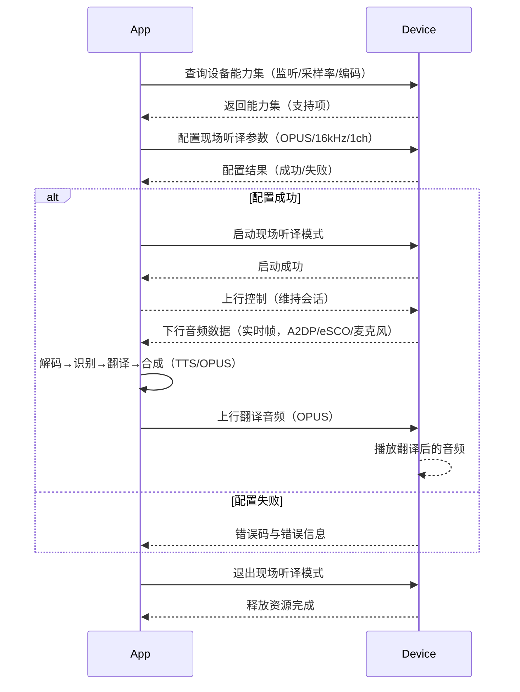
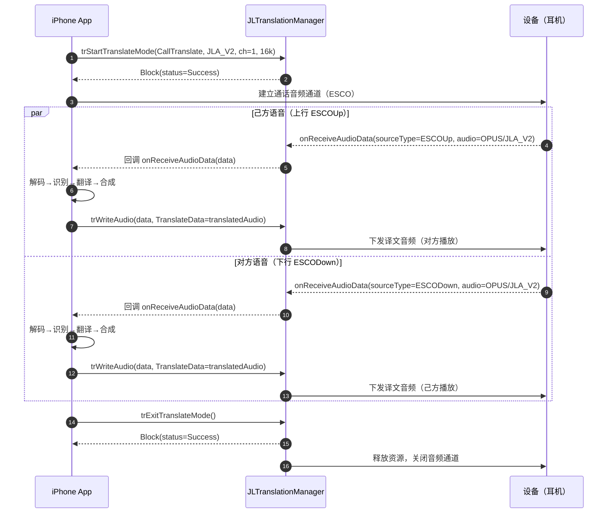
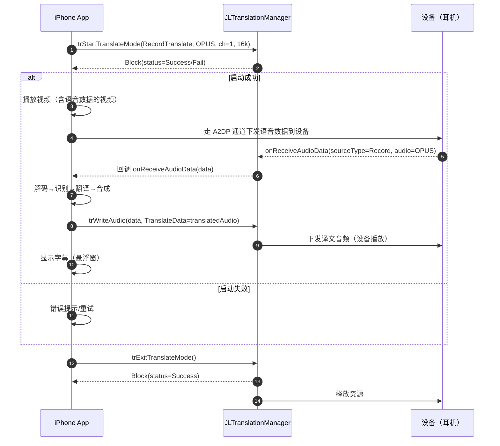
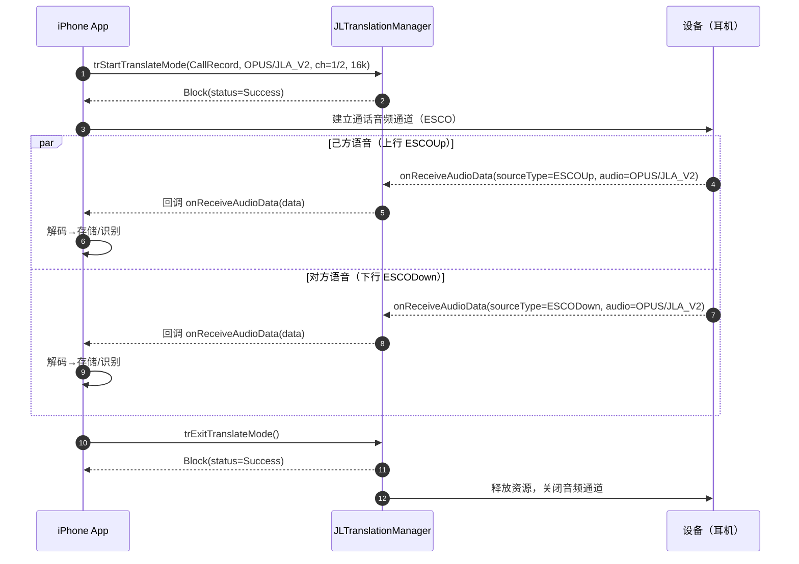

[toc]
# 翻译传输功能说明

## 版本记录

| 版本                    | 修改人   | 修改日期 | 修改内容               |
| ----------------------- | -------- | -------- | ---------------------- |
| V1.15.0_Beta1_20250526  | EzioChan | 20250526 | 增加通话录音模式支持   |
| V1.14.0_Beta13_20251225 | EzioChan | 20251225 | 增加立体声翻译支持     |
| V1.13.0_Beta2_20250213  | EzioChan | 20250213 | 修改延时发送为流控发送 |
| V1.13.0_Beta1_20250107  | EzioChan | 20250107 | 添加翻译传输功能       |


## 概述

当前功能用于描述第三方快速接入开发翻译传输功能，当前功能基于`JL_BLEKit.framework` 的**v 1.13.0 ** 版本增加。属于临时添加版本命名为：V1.14.0_Beta13_20251225，未经过大量测试，若遇到使用问题可及时反馈解决。

## 接入说明

### 1、添加框架

需要导入以下框架内容（必选）：

- `CoreBluetooth.framework` 系统蓝牙库

- `JL_BLEKit.framework` 主蓝牙业务库

- `JL_AdvParse.framework` 广播报解析库

- `JL_HashPair.framework` 配对认证库

- `JL_OTALib.framework` OTA 升级库

- `JLLogHelper.framework` 日志打印库

- `JLAudioUnitKit.framework` 音频库（仅解码Opus/Speex）（可选）

### 2、环境准备

-  在 Targets->Build Settings->Other Linker Flags 中添加 `-ObjC`

-  添加蓝牙权限：Info.plist 中添加 `Privacy - Bluetooth Always Usage Description `

-  添加蓝牙权限：Info.plist 中添加 `Privacy - Bluetooth Peripheral Usage Description `

### 3、蓝牙连接

```swift

import JL_AdvParse
import JL_BLEKit
import JL_HashPair
import JL_OTALib
import UIKit

class BleManager: NSObject {
    /// 单例
    static let shared = BleManager()

    /// 当前正在使用的设备（含广播信息对象）
    private var _currentEntity: JL_EntityM?

    /// 设备管理
    private var mBleMultiple: JL_BLEMultiple = .init()

    /// 自定义蓝牙接入助手
    private let assist: JL_Assist = .init()

    /// 搜索到的设备
    private var devices: [JL_EntityM] = []

    /// 当前连接的设备
    private var handleCbp: CBPeripheral?

    /// 设备的 mac 地址
    private var pMac: String?

    /// 蓝牙中心管理
    lazy var centerManager: CBCentralManager = .init(delegate: self, queue: .main)

    /// 搜索到的设备
    var blesArray: [JL_EntityM] {
        // 注意这里的 SettingInfo 记录了开发者是否启用自定义蓝牙连接和是否启用了 GATT over EDR 连接 的
        if SettingInfo.getCustomerBleConnect() || SettingInfo.getATTComunication() {
            return devices
        } else {
            return mBleMultiple.blePeripheralArr as! [JL_EntityM]
        }
    }

    /// 当前连接的设备
    var currentEntity: JL_EntityM? {
        get {
            // 注意这里的 SettingInfo 记录了开发者是否启用自定义蓝牙连接和是否启用了 GATT over EDR 连接 的
            if SettingInfo.getCustomerBleConnect() || SettingInfo.getATTComunication() {
                assist.mCmdManager.mEntity
            } else {
                _currentEntity
            }
        }
        set {
            _currentEntity = newValue
        }
    }

    /// 当前连接的命令管理对象
    var currentCmdMgr: JL_ManagerM? {
        if SettingInfo.getCustomerBleConnect() || SettingInfo.getATTComunication() {
            assist.mCmdManager
        } else {
            currentEntity?.mCmdManager
        }
    }

    override init() {
        super.init()
        /// 杰理 SDK 的日志
        JLLogManager.clearLog()
        JLLogManager.setLog(true, isMore: false, level: .DEBUG)
        JLLogManager.log(withTimestamp: true)
        JLLogManager.saveLog(asFile: true)

        /// 启用 SDK 蓝牙连接时需要使用
        mBleMultiple.ble_FILTER_ENABLE = true
        mBleMultiple.ble_TIMEOUT = 7
        setPairEnable(true)
    }

    /// 设置是否启用设备认证
    /// 若关闭，需要多方一起关闭包括设备端跟安卓端
    /// - Parameter status: 设备认证开关
    func setPairEnable(_ status: Bool) {
        SettingInfo.savePairEnable(status)
        mBleMultiple.ble_PAIR_ENABLE = status
        assist.mNeedPaired = status
    }

    /// 开始搜索
    func startSearchBle() {
        // 启用 GATT over EDR 时需要先连接上设备的 EDR 否则会搜索不到
        if SettingInfo.getATTComunication() {
            devices.removeAll()
            let uuid = SettingInfo.getAttDevUUID() ?? "AE00"
            let matchingOptions = [CBConnectionEventMatchingOption.serviceUUIDs: [uuid]]
            centerManager.registerForConnectionEvents(options: matchingOptions)
            centerManager.scanForPeripherals(withServices: nil, options: [CBConnectPeripheralOptionEnableTransportBridgingKey: true])
            return
        }
        // 启用自定义蓝牙连接是开发者自行搜索设备
        if SettingInfo.getCustomerBleConnect() {
            devices.removeAll()
            centerManager.scanForPeripherals(withServices: nil, options: [CBConnectPeripheralOptionEnableTransportBridgingKey: true])
        } else {
            // 启用 SDK 蓝牙连接时，调用库里的方法直接搜索
            mBleMultiple.scanStart()
        }
    }

    /// 停止搜索
    func stopSearchBle() {
        if SettingInfo.getCustomerBleConnect() {
            centerManager.stopScan()
        } else {
            mBleMultiple.scanStop()
        }
    }

    /// 根据 cbp 更新当前连接的设备
    /// - Parameter cbp: 当前连接的设备
    func mutilUpdateEntity(_ cbp: CBPeripheral) {
        if let items = mBleMultiple.bleConnectedArr as? [JL_EntityM] {
            if let entity = items.first(where: { $0.mUUID == cbp.identifier.uuidString }) {
                _currentEntity = entity
            }
        }
    }

    /// 连接设备
    /// - Parameter entity: 要连接的设备
    func connectEntity(_ entity: JL_EntityM) {
        if SettingInfo.getATTComunication() {
            centerManager.connect(entity.mPeripheral)
            return
        }

        stopSearchBle()

        if SettingInfo.getCustomerBleConnect() {
            // 这里的连接增加了一个连接参数，用于设备支持 CTKD 协议时的，GATT OVER EDR 连接时可忽略
            // 连接的结果需要看 centerManager 的代理回调
            centerManager.connect(entity.mPeripheral, options: [CBConnectPeripheralOptionEnableTransportBridgingKey: true])
        } else {
            // SDK 蓝牙连接，连接结果会在这里返回
            mBleMultiple.connectEntity(entity) { st in
                switch st {
                case .bleOFF:
                    JL_Tools.post(kJL_CONNECT_FAILED, object: entity.mPeripheral)
                case .connectFail:
                    JL_Tools.post(kJL_CONNECT_FAILED, object: entity.mPeripheral)
                case .connecting:
                    break
                case .connectRepeat:
                    break
                case .connectTimeout:
                    JL_Tools.post(kJL_CONNECT_FAILED, object: entity.mPeripheral)
                case .connectRefuse:
                    JL_Tools.post(kJL_CONNECT_FAILED, object: entity.mPeripheral)
                case .pairFail:
                    JL_Tools.post(kJL_CONNECT_FAILED, object: entity.mPeripheral)
                case .pairTimeout:
                    JL_Tools.post(kJL_CONNECT_FAILED, object: entity.mPeripheral)
                case .paired:
                    BleManager.shared.currentEntity = entity
                    SettingInfo.setToHistory(entity.mUUID)
                case .masterChanging:
                    break
                case .disconnectOk:
                    break
                case .null:
                    break
                @unknown default:
                    break
                }
            }
        }
    }

    /// 重新连接
    /// 一般用于 OTA 的但备份升级回连
    /// - Parameter mac: 设备的 mac 地址
    func reConnectWithMac(_ mac: String) {
        pMac = mac
        startSearchBle()
    }

    /// 断开连接
    func disconnectEntity() {
        if SettingInfo.getCustomerBleConnect() {
            centerManager.cancelPeripheralConnection(BleManager.shared.handleCbp!)
        } else {
            mBleMultiple.disconnectEntity(BleManager.shared.currentEntity!) { _ in
            }
        }
    }

    /// 根据历史记录连接
    func connectByHistory() {
        if let uuid = SettingInfo.getToHistory() {
            // 当设备支持 ANCS 协议时，可通过这个方法找到已连接的设备
            if let entity = BleManager.shared.mBleMultiple.makeEntity(withUUID: uuid) {
                if SettingInfo.getCustomerBleConnect() {
                    startSearchBle()
                } else {
                    connectEntity(entity)
                }
            }
        }
    }
}

/** CBCentralManagerDelegate
 在自定义蓝牙连接时需要处理以下的内容
 - centralManagerDidUpdateState: 蓝牙状态更新
 - centralManager(_: connectionEventDidOccur event: CBConnectionEvent, for peripheral: CBPeripheral): 连接事件
 - centralManager(_: didFailToConnect peripheral: CBPeripheral, error: Error?): 连接失败
 - centralManager(_: didDisconnectPeripheral peripheral: CBPeripheral, error: Error?): 连接断开
 - centralManager(_: didConnect peripheral: CBPeripheral): 连接成功
 */
extension BleManager: CBCentralManagerDelegate {
    /// 蓝牙状态更新
    /// - Parameter central: CBCentralManager
    func centralManagerDidUpdateState(_ central: CBCentralManager) {
        if central.state == .poweredOn {
            startSearchBle()
        }
        assist.assistUpdate(central.state)
    }

    /// 连接事件
    /// 此代理方法是针对 GATT over EDR 的，当支持 ATT 连接的设备都 EDR 连上或者断开时都会触发此方法
    /// - Parameters:
    ///   - _: 蓝牙中心
    ///   - event: 连接事件
    ///   - peripheral: 连接的设备
    func centralManager(_: CBCentralManager, connectionEventDidOccur event: CBConnectionEvent, for peripheral: CBPeripheral) {
        if event == .peerConnected {
            let newEntity = JL_EntityM()
            newEntity.mUUID = peripheral.identifier.uuidString
            newEntity.setBlePeripheral(peripheral)
            if peripheral.name != nil {
                if devices.contains(where: { $0.mPeripheral.name == peripheral.name }) {
                } else {
                    devices.append(newEntity)
                }
            }
        }
    }

    func centralManager(_: CBCentralManager, didDiscover peripheral: CBPeripheral, advertisementData: [String: Any], rssi _: NSNumber) {
        if devices.contains(where: { $0.mUUID == peripheral.identifier.uuidString }) {
        } else {
            let newEntity = JL_EntityM()
            newEntity.mUUID = peripheral.identifier.uuidString
            newEntity.setBlePeripheral(peripheral)
            if peripheral.name != nil {
                if devices.contains(where: { $0.mPeripheral.name == peripheral.name }) {
                } else {
                    devices.append(newEntity)
                }
            }
        }
        if pMac != nil {
            if let blead = advertisementData["kCBAdvDataManufacturerData"] as? Data {
                if JL_BLEAction.otaBleMacAddress(pMac!, isEqualToCBAdvDataManufacturerData: blead) {
                    stopSearchBle()
                    DispatchQueue.main.asyncAfter(deadline: .now() + 1, execute: DispatchWorkItem(block: {
                        self.centerManager.connect(peripheral, options: [CBConnectPeripheralOptionEnableTransportBridgingKey: true])
                        self.pMac = nil
                    }))
                }
            }
        }
        JL_Tools.post(kJL_BLE_M_FOUND, object: blesArray)
    }

    func centralManager(_: CBCentralManager, didConnect peripheral: CBPeripheral) {
        peripheral.delegate = self
        peripheral.discoverServices(nil)
    }

    func centralManager(_: CBCentralManager, didDisconnectPeripheral peripheral: CBPeripheral, error _: Error?) {
        assist.assistDisconnectPeripheral(peripheral)
        assist.mCmdManager.mEntity = nil
        handleCbp = nil
        currentEntity = nil
        JL_Tools.post(kJL_BLE_M_ENTITY_DISCONNECTED, object: peripheral)
    }

    func centralManager(_: CBCentralManager, didFailToConnect peripheral: CBPeripheral, error _: Error?) {
        JL_Tools.post(kJL_CONNECT_FAILED, object: peripheral)
    }
}

/**
 CBPeripheralDelegate
 在自定义蓝牙连接时，需要处理以下内容
 - peripheral(_: didDiscoverServices error: Error?): 发现服务
 - peripheral(_: didDiscoverCharacteristicsFor service: CBService, error: Error?): 发现特征
 - peripheral(_: didUpdateNotificationStateFor characteristic: CBCharacteristic, error: Error?): 更新通知
 */
extension BleManager: CBPeripheralDelegate {
    func peripheral(_ peripheral: CBPeripheral, didDiscoverServices _: Error?) {
        for service in peripheral.services! {
            peripheral.discoverCharacteristics(nil, for: service)
        }
    }

    func peripheral(_ peripheral: CBPeripheral, didDiscoverCharacteristicsFor service: CBService, error _: Error?) {
        assist.assistDiscoverCharacteristics(for: service, peripheral: peripheral)
    }

    func peripheral(_ peripheral: CBPeripheral, didUpdateNotificationStateFor characteristic: CBCharacteristic, error _: Error?) {
        if SettingInfo.getPairEnable() {
            // 自定义蓝牙连接时，连上设备后需要进行设备认证
            assist.assistUpdate(characteristic, peripheral: peripheral) { isPaired in
                if isPaired {
                    SettingInfo.setToHistory(peripheral.identifier.uuidString)
                    self.handleCbp = peripheral
                    let entity = JL_EntityM()
                    entity.setBlePeripheral(self.handleCbp!)
                    self.assist.mCmdManager.mEntity = entity
                    JL_Tools.post(kJL_BLE_M_ENTITY_CONNECTED, object: peripheral)
                } else {
                    self.centerManager.cancelPeripheralConnection(peripheral)
                }
            }
        } else {
            // 不需要认证时，直接回调成功
            SettingInfo.setToHistory(peripheral.identifier.uuidString)
            handleCbp = peripheral
            let entity = JL_EntityM()
            entity.setBlePeripheral(handleCbp!)
            assist.mCmdManager.mEntity = entity
            JL_Tools.post(kJL_BLE_M_ENTITY_CONNECTED, object: peripheral)
        }
    }

    func peripheral(_: CBPeripheral, didUpdateValueFor characteristic: CBCharacteristic, error _: Error?) {
        // 自定义连接是设备更新数据过来时，需要通过此方法传入 SDK 处理
        assist.assistUpdateValue(for: characteristic)
    }
}
    
```


## 翻译传输功能使用

### **概述**

翻译传输功能是一个基于蓝牙通信的音频翻译解决方案，采用分层架构设计。核心组件包括：

- **JLTranslationManager**：翻译传输管理器，负责整体功能协调和对外接口
- **JLTranslateSet**：翻译设置协议层，处理与设备的通信协议
- **内部队列管理**：音频数据的缓存、分包和传输处理
- **录音模式管理**：设备端录音功能的内部控制

**主要功能特性：**
- 支持7种翻译模式（空闲、仅录音、录音翻译、通话翻译、音频翻译、面对面翻译、通话录音模式）
- 支持多种音频来源（文件、设备麦克风、手机麦克风、eSCO、A2DP）
- 完整的状态监控和错误处理机制
- 设备能力检测和配置管理
- 音频数据的实时处理和传输

------


------

## **使用指南**

### 1. **初始化**

在 `TranslateViewController` 中初始化 `JLTranslationManager`：

```objc
// 这里的 BleManager.shared.currentCmdMgr 是当前连接的设备的命令管理器，确保在设备连接后初始化
JLBleManager *manager = [BleManager shared].currentCmdMgr;
if (manager) {
    self.translateHelper = [[JLTranslationManager alloc] initWithDelegate:self manager:manager];
}
```

### 2. **设置翻译模式**

在 UI 按钮点击事件中配置翻译模式：

```objc
JLTranslateSetMode *mode = [[JLTranslateSetMode alloc] init];
mode.modeType = JLTranslateSetModeTypeRecordTranslate;
mode.channel = 1;
mode.sampleRate = 16000;
mode.dataType = JL_SpeakDataTypeOPUS;
[self.translateHelper trStartTranslateMode:mode];
```

### 3. **退出翻译模式**

调用 `trExitMode` 退出当前模式：

```objc
[self.translateHelper trExitMode];
```

### 4. **接收翻译音频数据**

通过代理方法接收设备返回的音频数据：

```objc
- (void)onReceiveAudioData:(NSString *)uuid audioData:(JLTranslateAudio *)data {
    // 数据处理逻辑
    [self.opusDecoder opusDecoderInputData:data.data];
}
```

### 5. **销毁对象**

在页面关闭时销毁对象并释放资源：

```objc
[self.translateHelper trDestory];
[self.opusDecoder opusOnRelease];
```

## **高级使用场景**

### **1. 录音模式翻译**

类似录⾳笔，使⽤的是⽿机的⻨克⻛，录音模式适用于需要在设备端进行录音并翻译的场景。以下是一个简单的实现示例：



实现代码参考：

```objc
// 配置录音模式
JLTranslateSetMode *recordMode = [[JLTranslateSetMode alloc] init];
recordMode.modeType = JLTranslateSetModeTypeOnlyRecord;
recordMode.channel = 1;
recordMode.sampleRate = 16000;
recordMode.dataType = JL_SpeakDataTypeOPUS;

/// 配置 Opus 解码器
JLOpusFormat *ops = [JLOpusFormat defaultFormats];
ops.hasDataHeader = NO;
self.opusDecoder = [[JLOpusDecoder alloc] initWithDecoder:ops delegate:self];
        
// 启动录音模式
[translationManager trStartTranslateMode:recordMode Block:^(JLTranslateSetResultType status, NSError *err) {
    if (status == JLTranslateSetResultTypeSuccess) {
        NSLog(@"录音模式启动成功");
    }
}];


//MARK: - JLTranslationManagerDelegate

/// 初始化成功
/// @param uuid 设备UUID
-(void)onInitSuccess:(NSString *)uuid {
    NSLog(@"初始化成功");
}

/// 模式改变
/// @param uuid 设备UUID
/// @param mode 翻译模式
-(void)onModeChange:(NSString *)uuid Mode:(JLTranslateSetMode *)mode {
    if (mode.modeType == JLTranslateSetModeTypeOnlyRecord) {
        NSLog(@"已切换到录音模式");
    }
}

/// 音频数据
/// @param uuid 设备UUID
/// @param data 音频数据
-(void)onReceiveAudioData:(NSString *)uuid AudioData:(JLTranslateAudio *)data {
    // 数据处理逻辑
    // 这里只针对 opus 做了解码，其他数据类型需要根据实际情况处理
    if (data.audioType == JL_SpeakDataTypeOPUS) {
        [self.opusDecoder opusDecoderInputData:data.data];
    }
}

/// 错误
/// @param uuid 设备UUID
/// @param err 错误
-(void)onError:(NSString *)uuid Error:(NSError *) err {
    NSLog(@"错误：%@", err.localizedDescription);
}

//MARK：- opus delegate 

/// Opus 数据解码
/// - Parameters:
///   - decoder: 解码器
///   - data: pcm 数据
///   - error: 错误信息
-(void)opusDecoder:(JLOpusDecoder *)decoder Data:(NSData* _Nullable)data error:(NSError* _Nullable)error {
    if (error) {
        NSLog(@"Opus 解码错误：%@", error.localizedDescription);
        return;
    }
    
    // 处理解码后的 PCM 数据
    // 这里可以将 PCM 数据播放出来，或者进行其他处理
    // 例如：将 PCM 数据写入音频文件
    [self writePCMDataToFile:data];
}

```
### **2. 现场听译**

场景如现场讲座，将演讲⼈说的语⾔，实时翻译成佩戴者能听懂的语⾔，⻨克⻛和听筒使⽤的都是⽿机的。
场景如现场聆听，将设备端播放的音频，实时翻译成佩戴者能听懂的语⾔，⻨克⻛和听筒使⽤的都是⽿机的。




参考的实现代码：

```objc
// 配置录音模式
JLTranslateSetMode *recordMode = [[JLTranslateSetMode alloc] init];
recordMode.modeType = JLTranslateSetModeTypeRecordTranslate;
recordMode.channel = 1;
recordMode.sampleRate = 16000;
recordMode.dataType = JL_SpeakDataTypeOPUS;

/// 配置 Opus 解码器
JLOpusFormat *ops = [JLOpusFormat defaultFormats];
ops.hasDataHeader = NO;
self.opusDecoder = [[JLOpusDecoder alloc] initWithDecoder:ops delegate:self];
        
// 启动录音模式
[translationManager trStartTranslateMode:recordMode Block:^(JLTranslateSetResultType status, NSError *err) {
    if (status == JLTranslateSetResultTypeSuccess) {
        NSLog(@"录音模式启动成功");
    }
}];


//MARK: - JLTranslationManagerDelegate

/// 初始化成功
/// @param uuid 设备UUID
-(void)onInitSuccess:(NSString *)uuid {
    NSLog(@"初始化成功");
}

/// 模式改变
/// @param uuid 设备UUID
/// @param mode 翻译模式
-(void)onModeChange:(NSString *)uuid Mode:(JLTranslateSetMode *)mode {
    if (mode.modeType == JLTranslateSetModeTypeRecordTranslate) {
        NSLog(@"已切换到录音翻译模式");
    }
}

/// 音频数据
/// @param uuid 设备UUID
/// @param data 音频数据
-(void)onReceiveAudioData:(NSString *)uuid AudioData:(JLTranslateAudio *)data {
    // 数据处理逻辑
    // 这里只针对 opus 做了解码，其他数据类型需要根据实际情况处理
    if (data.audioType == JL_SpeakDataTypeOPUS) {
        [self.opusDecoder opusDecoderInputData:data.data];
    }
}

/// 错误
/// @param uuid 设备UUID
/// @param err 错误
-(void)onError:(NSString *)uuid Error:(NSError *) err {
    NSLog(@"错误：%@", err.localizedDescription);
}

//MARK：- opus delegate 

/// Opus 数据解码
/// - Parameters:
///   - decoder: 解码器
///   - data: pcm 数据
///   - error: 错误信息
-(void)opusDecoder:(JLOpusDecoder *)decoder Data:(NSData* _Nullable)data error:(NSError* _Nullable)error {
    if (error) {
        NSLog(@"Opus 解码错误：%@", error.localizedDescription);
        return;
    }
    
    // 处理解码后的 PCM 数据
    // 这里可以将 PCM 数据进行语音识别
    //实现语音识别需要另外实现，这里不做赘述
    [BaiduSpeechRecognitionManager toString:data];

}

//翻译数据处理结果
-(void)onTranslateResult:(NSString *)result {
    NSLog(@"翻译结果：%@", result);
    // 为了能让耳机播放内容，这里需要将当前识别到的语音文字，转成 TTS 语音数据，发送给设备进行播放
    //实现 TTS 语音合成需要另外实现，这里不做赘述
    [BaiduSpeechSynthesisManager toSpeech:result];
}

//语音TTS 生成结果
-(void)onSynthesisResult:(NSData *)data {
    // 处理翻译后的音频数据，这里一般的数据都是 pcm 内容，所以我们还要在此处，将 pcm 的数据转回 opus 编码
    //实现 opus 编码需要另外实现，可以参考本文后面的 Opus 编码部分内容
    [self.opusEncoder opusEncoderInputData:data];
}

//MARK：- opus delegate 

/// PCM 数据编码
/// - Parameters:
///   - encoder: 解码器
///   - data: opus 数据
///   - error: 错误信息
-(void)opusEncoder:(JLOpusEncoder *)encoder Data:(NSData* _Nullable)data error:(NSError* _Nullable)error {
    if (error) {
        NSLog(@"Opus 编码错误：%@", error.localizedDescription);
        return;
    }
    
    // 处理编码后的 Opus 数据
    // 这里可以将 Opus 数据发送给设备进行播放
    JLTranslateAudio *audioData = [JLTranslateAudio new];
    audioData.sourceType = JLTranslateAudioTypeDeviceMic;
    audioData.audioType =JL_SpeakDataTypeOPUS;
    [translationManager trWriteAudio:audioData TranslateData:data];

}
```


### **3. 面对面翻译**

面对面翻译模式支持单路切换翻译，适用于跨语言交流场景：

```objc
// 配置面对面翻译模式
JLTranslateSetMode *faceToFaceMode = [[JLTranslateSetMode alloc] init];
faceToFaceMode.modeType = JLTranslateSetModeTypeFaceToFaceTranslate;
faceToFaceMode.dataType = JL_SpeakDataTypeOPUS;
faceToFaceMode.channel = 1;
faceToFaceMode.sampleRate = 16000;

[translationManager trStartTranslateMode:faceToFaceMode Block:^(JLTranslateSetResultType status, NSError *err) {
    if (status == JLTranslateSetResultTypeSuccess) {
        NSLog(@"面对面翻译模式启动成功");
    }
}];

//开启手机端录音
//
//采取手机采麦的方式，获取到 PCM 数据后，将数据识别成文字显示在 UI 上，再通过 tts 语音合成，将文字合成语音，然后再转换成 Opus 下发给设备播放（需要参考 opus 编码部分内容）
//此处仅展示下发 Opus 数据给设备部分内容
-(void)sendDataToDevice:(NSData *)data {
  // 将翻译后的音频数据写回设备需要创建一个JLTranslateAudio 声明 sourceType 以及 audioType 的类型
	// 方法一：标准写回方法（推荐）
  JLTranslateAudio *audioData = [JLTranslateAudio new];
  audioData.sourceType = JLTranslateAudioTypePhoneMic;
  audioData.audioType =JL_SpeakDataTypeOPUS;
	[translationManager trWriteAudio:audioData TranslateData:data];
}

      
//监听 translationManager 的回调
/// 音频数据
/// @param uuid 设备UUID
/// @param data 音频数据
-(void)onReceiveAudioData:(NSString *)uuid AudioData:(JLTranslateAudio *)data {
    // 数据处理逻辑
    // 当面对面模式时，此数据一般是来自于设备端发送过来的 opus 数据，可以直接传给 opus 解析器进行解析。
    
    // 1. 解码音频数据
    NSData *decodedAudio = [self decodeOPUSData:data.data];
    
    // 2. 进行语音识别和翻译
    [self performSpeechRecognitionAndTranslation:decodedAudio completion:^(NSString *translatedText, NSData *translatedAudioData) {
        if (translatedAudioData) {
            //这里可以选择让扬声器发声播放设备端采麦过来的数据
        }
    }];
}

// 语音识别和翻译处理
// 开发者需要根据自行接入的识别和翻译厂商的 API 文档，实现语音转文字、文字翻译和文字转语音的功能。
// 注意：文字转语音服务只能生成PCM格式音频，需要通过本地方法压缩为OPUS/JLA_V2格式。
- (void)performSpeechRecognitionAndTranslation:(NSData *)audioData completion:(void(^)(NSString *text, NSData *audioData))completion {
  //参考 opus 解码的内容
   //TODO: 自行实现
}

```

### **4. 通话翻译集成**

通话翻译模式可以在通话过程中提供实时翻译服务：

场景说明：与外国⼈打电话，佩戴者说⾃⼰的⺟语，外国⼈听到的是他们的⺟语，外国⼈说他们的⺟语，佩戴者听
到的是佩戴者的⺟语;
佩戴着，左⽿能收听到原声，右⽿听到译⽂

交互逻辑参考以下：



参考实现代码：

```objc
JLTranslateSetMode *faceToFaceMode = [[JLTranslateSetMode alloc] init];
faceToFaceMode.modeType = JLTranslateSetModeTypeCallTranslate;
faceToFaceMode.dataType = JL_SpeakDataTypeJLA_V2;
faceToFaceMode.channel = 1;
faceToFaceMode.sampleRate = 16000;

[translationManager trStartTranslateMode:faceToFaceMode Block:^(JLTranslateSetResultType status, NSError *err) {
    if (status == JLTranslateSetResultTypeSuccess) {
        NSLog(@"通话翻译模式启动成功");
    }
}];

//监听 translationManager 的回调
/// 音频数据
/// @param uuid 设备UUID
/// @param data 音频数据
-(void)onReceiveAudioData:(NSString *)uuid AudioData:(JLTranslateAudio *)data {
    // 数据处理逻辑
    // 当通话翻译模式时，此数据是通话过程中的音频数据，可以进行后续处理，如语音转文字。
    //这里要区分上行和下行数据
    
    // 通话时，己方的语音内容
    if (data.sourceType == JLTranslateAudioTypeESCOUp) {
        // 己方语音：解码 -> 识别 -> 翻译 -> 合成 -> 写回给对方
        [self processCallAudio:data isUplink:YES completion:^(NSData *translatedAudio) {
            if (translatedAudio) {
                // 标准写回方法，确保音频质量
                [translationManager trWriteAudio:data TranslateData:translatedAudio];
                NSLog(@"己方语音翻译完成，已发送给对方");
            }
        }];
    }
    
    // 通话时，对方的语音内容
    if (data.sourceType == JLTranslateAudioTypeESCODown) {
        // 对方语音：解码 -> 识别 -> 翻译 -> 合成 -> 写回给己方
        [self processCallAudio:data isUplink:NO completion:^(NSData *translatedAudio) {
            if (translatedAudio) {
                // 标准写回方法，确保音频质量
                [translationManager trWriteAudio:data TranslateData:translatedAudio];
                NSLog(@"对方语音翻译完成，已发送给己方");
            }
        }];
    }
}

// 通话音频处理
- (void)processCallAudio:(JLTranslateAudio *)audioData isUplink:(BOOL)isUplink completion:(void(^)(NSData *translatedAudio))completion {
    // 1. 解码JLA_V2格式音频
   	// 参考下述的 JLAV2编解码描述实现
    // 2.注意翻译的语言种类
    //TODO: 识别翻译合成完成之类的任务
}


// 监听通话状态
- (void)isOnCalling:(BOOL)isCalling UUID:(NSString *)uuid {
    // 通话状态变化时，根据 isCalling 来判断是否启动通话翻译模式
}
```

### **5. 音视频翻译**

场景说明：看⼿机上的视频，⼿机悬浮窗上显示字幕。

交互逻辑参考以下：


**参考实现代码如下：**

```objc
// 配置录音翻译模式
JLTranslateSetMode *recordMode = [[JLTranslateSetMode alloc] init];
recordMode.modeType = JLTranslateSetModeTypeAudioTranslate;
recordMode.dataType = JL_SpeakDataTypeOPUS;
recordMode.channel = 1;
recordMode.sampleRate = 16000;

// 启动音频翻译模式
[translationManager trStartTranslateMode:recordMode Block:^(JLTranslateSetResultType status, NSError *err) {
    if (status == JLTranslateSetResultTypeSuccess) {
        NSLog(@"录音翻译模式启动成功");
        // 开始录音
        [self startRecording];
    } else {
        NSLog(@"录音翻译模式启动失败: %@", err.localizedDescription);
    }
}];

// 配置录音模式
JLTranslateSetMode *recordMode = [[JLTranslateSetMode alloc] init];
recordMode.modeType = JLTranslateSetModeTypeRecordTranslate;
recordMode.channel = 1;
recordMode.sampleRate = 16000;
recordMode.dataType = JL_SpeakDataTypeOPUS;

/// 配置 Opus 解码器
JLOpusFormat *ops = [JLOpusFormat defaultFormats];
ops.hasDataHeader = NO;
self.opusDecoder = [[JLOpusDecoder alloc] initWithDecoder:ops delegate:self];
        
// 启动录音模式
[translationManager trStartTranslateMode:recordMode Block:^(JLTranslateSetResultType status, NSError *err) {
    if (status == JLTranslateSetResultTypeSuccess) {
        NSLog(@"录音模式启动成功");
    }
}];


//MARK: - JLTranslationManagerDelegate

/// 初始化成功
/// @param uuid 设备UUID
-(void)onInitSuccess:(NSString *)uuid {
    NSLog(@"初始化成功");
}

/// 模式改变
/// @param uuid 设备UUID
/// @param mode 翻译模式
-(void)onModeChange:(NSString *)uuid Mode:(JLTranslateSetMode *)mode {
    if (mode.modeType == JLTranslateSetModeTypeAudioTranslate) {
        NSLog(@"已切换到音频翻译模式");
        //TODO: 开发者或可以在此处启动视频播放，避免丢失部分音频数据内容
        
    }
}

/// 音频数据
/// @param uuid 设备UUID
/// @param data 音频数据
-(void)onReceiveAudioData:(NSString *)uuid AudioData:(JLTranslateAudio *)data {
    // 数据处理逻辑
    // 这里只针对 opus 做了解码，其他数据类型需要根据实际情况处理
    if (data.audioType == JL_SpeakDataTypeOPUS) {
        [self.opusDecoder opusDecoderInputData:data.data];
    }
}

/// 错误
/// @param uuid 设备UUID
/// @param err 错误
-(void)onError:(NSString *)uuid Error:(NSError *) err {
    NSLog(@"错误：%@", err.localizedDescription);
}

//MARK：- opus delegate 

/// Opus 数据解码
/// - Parameters:
///   - decoder: 解码器
///   - data: pcm 数据
///   - error: 错误信息
-(void)opusDecoder:(JLOpusDecoder *)decoder Data:(NSData* _Nullable)data error:(NSError* _Nullable)error {
    if (error) {
        NSLog(@"Opus 解码错误：%@", error.localizedDescription);
        return;
    }
    
    // 处理解码后的 PCM 数据
    // 这里可以将 PCM 数据进行语音识别
    //实现语音识别需要另外实现，这里不做赘述
    [BaiduSpeechRecognitionManager toString:data];

}

//翻译数据处理结果
-(void)onTranslateResult:(NSString *)result {
    NSLog(@"翻译结果：%@", result);
    //此处可以显示的内容回调到上层显示
}
```

### **6. 通话录音模式**

通话录音模式适用于在通话过程中进行录音的场景，支持对通话双方的声音进行录制和后续处理。

场景说明：在通话过程中，需要录制通话内容用于后续的文字转写、存档或分析。

交互逻辑参考以下：



参考实现代码：

```objc
// 配置通话录音模式
JLTranslateSetMode *callRecordMode = [[JLTranslateSetMode alloc] init];
callRecordMode.modeType = JLTranslateSetModeTypeCallRecord;
callRecordMode.dataType = JL_SpeakDataTypeOPUS;  // 或 JL_SpeakDataTypeJLA_V2
callRecordMode.channel = 1;  // 单声道录制，如需区分双方可使用双声道
callRecordMode.sampleRate = 16000;

[translationManager trStartTranslateMode:callRecordMode Block:^(JLTranslateSetResultType status, NSError *err) {
    if (status == JLTranslateSetResultTypeSuccess) {
        NSLog(@"通话录音模式启动成功");
    }
}];

//监听 translationManager 的回调
/// 音频数据
/// @param uuid 设备UUID
/// @param data 音频数据
-(void)onReceiveAudioData:(NSString *)uuid AudioData:(JLTranslateAudio *)data {
    // 数据处理逻辑
    // 通话录音模式时，根据 sourceType 区分上行和下行音频
    
    // 己方语音（上行）
    if (data.sourceType == JLTranslateAudioTypeESCOUp) {
        // 处理己方语音数据
        [self processCallRecordAudio:data isUplink:YES];
    }
    
    // 对方语音（下行）
    if (data.sourceType == JLTranslateAudioTypeESCODown) {
        // 处理对方语音数据
        [self processCallRecordAudio:data isUplink:NO];
    }
}

// 通话录音音频处理
- (void)processCallRecordAudio:(JLTranslateAudio *)audioData isUplink:(BOOL)isUplink {
    // 1. 解码音频数据（OPUS/JLA_V2 转 PCM）
    // 2. 存储到文件或进行实时语音识别
    // 3. 根据需要区分上行/下行音频
    NSString *source = isUplink ? @"己方" : @"对方";
    NSLog(@"%@ 音频数据: %lu bytes", source, (unsigned long)audioData.data.length);
}

// 监听通话状态
- (void)isOnCalling:(BOOL)isCalling UUID:(NSString *)uuid {
    // 通话状态变化时，根据 isCalling 来判断是否启动/停止通话录音模式
    if (!isCalling && [translationManager trIsWorking]) {
        // 通话结束，退出录音模式
        [translationManager trExitMode:nil];
    }
}
```

**注意事项：**
- 通话录音模式需要在通话建立后才能正常使用
- 根据设备能力选择单声道或双声道录制
- 双声道录制时，左声道通常为下行（对方语音），右声道为上行（己方语音）
- 录音数据格式支持 OPUS 和 JLA_V2，根据设备支持情况选择

------

## **编解码器详细使用指南**

### **1. OPUS编解码器**

#### **1.1 OPUS编解码器概述**

OPUS编解码器基于 `JLAudioUnitKit` 框架，提供高质量的音频压缩和解压缩功能。主要特点：

- **高音质**：适用于面对面翻译和录音翻译场景
- **标准格式**：基于开源OPUS标准，兼容性好
- **灵活配置**：支持多种采样率和声道配置

#### **1.2 OPUS编解码器核心类**

**JLOpusFormat - 音频格式配置类**

```objc
@interface JLOpusFormat : NSObject

/// 采样率（默认16000Hz）
@property (nonatomic, assign) int sampleRate;

/// 单/双声道（默认1）
@property (nonatomic, assign) int channels;

/// 帧长度（默认20ms）
@property (nonatomic, assign) int frameDuration;

/// 比特率
@property (nonatomic, assign) int bitRate;

/// 数据帧大小（只读）
@property (nonatomic, assign, readonly) int frameSize;

/// 数据大小
@property (nonatomic, assign) int dataSize;

/// 是否包含数据头部（默认YES）
@property (nonatomic, assign) BOOL hasDataHeader;

/// 获取默认配置
+ (JLOpusFormat*)defaultFormats;

@end
```

**JLOpusEncoder - OPUS编码器**

```objc
@interface JLOpusEncoder : NSObject

/// 音频格式配置
@property (nonatomic, strong) JLOpusFormat *opusFormat;

/// 代理回调
@property (nonatomic, weak) id<JLOpusEncoderDelegate> delegate;

/// 初始化编码器
- (instancetype)initFormat:(JLOpusFormat *)format delegate:(id<JLOpusEncoderDelegate>)delegate;

/// 编码PCM数据
- (void)opusEncodeData:(NSData *)data;

/// 编码PCM文件
- (void)opusEncodeFile:(NSString *)pcmPath outPut:(NSString *)outPut Resoult:(JLOpusEncoderConvertBlock)result;

/// 释放资源
- (void)opusOnRelease;

@end
```

**JLOpusDecoder - OPUS解码器**

```objc
@interface JLOpusDecoder : NSObject

/// 音频格式配置
@property (nonatomic, strong) JLOpusFormat *opusFormat;

/// 代理回调
@property (nonatomic, weak) id<JLOpusDecoderDelegate> delegate;

/// 初始化解码器
- (instancetype)initDecoder:(JLOpusFormat *)format delegate:(id<JLOpusDecoderDelegate>)delegate;

/// 重置解码格式
- (void)resetOpusFramet:(JLOpusFormat *)format;

/// 解码OPUS数据
- (void)opusDecoderInputData:(NSData *)data;

/// 解码OPUS文件
- (void)opusDecodeFile:(NSString *)input outPut:(NSString *)outPut Resoult:(JLOpusDecoderConvertBlock)result;

/// 释放资源
- (void)opusOnRelease;

@end
```

#### **1.3 OPUS编解码器使用示例**

**Objective-C封装类 - TranslateOpusHelper**

**TranslateOpusHelper.h**

```objc
#import <Foundation/Foundation.h>
#import <JLAudioUnitKit/JLAudioUnitKit.h>

NS_ASSUME_NONNULL_BEGIN

/**
 * @brief 编解码协议定义
 * @description 定义了音频编解码器的基本接口，支持PCM和压缩格式之间的转换
 */
@protocol TranslateDeEncodePtl <NSObject>

/// 初始化方法
/// @param pcmResultBlock PCM数据回调
/// @param opusResultBlock 压缩数据回调
- (instancetype)initWithPcmResultBlock:(void(^)(NSData *data))pcmResultBlock 
                       opusResultBlock:(void(^)(NSData *data))opusResultBlock;

/// PCM数据编码为压缩格式
/// @param pcmData PCM音频数据
- (void)pcmToEnCodeData:(NSData *)pcmData;

/// 压缩数据解码为PCM格式
/// @param decodeData 压缩音频数据
- (void)decodeDataToPcm:(NSData *)decodeData;

/// 销毁编解码器
- (void)onDestory;

@end

/**
 * @brief OPUS编解码器封装类
 * @description 提供OPUS格式音频的编码和解码功能，适用于面对面翻译和录音翻译场景
 */
@interface TranslateOpusHelper : NSObject <TranslateDeEncodePtl, JLOpusDecoderDelegate, JLOpusEncoderDelegate>

@property (nonatomic, strong) JLOpusDecoder *opusToPcm;
@property (nonatomic, strong) JLOpusEncoder *pcmToOpus;
@property (nonatomic, copy) void(^pcmResultBlock)(NSData *data);
@property (nonatomic, copy) void(^opusResultBlock)(NSData *data);

@end

NS_ASSUME_NONNULL_END
```

**TranslateOpusHelper.m**

```objc
#import "TranslateOpusHelper.h"

@implementation TranslateOpusHelper

- (instancetype)initWithPcmResultBlock:(void(^)(NSData *data))pcmResultBlock 
                       opusResultBlock:(void(^)(NSData *data))opusResultBlock {
    self = [super init];
    if (self) {
        self.pcmResultBlock = pcmResultBlock;
        self.opusResultBlock = opusResultBlock;
        
        // 配置OPUS格式
        JLOpusFormat *opusFormat = [JLOpusFormat defaultFormats];
        opusFormat.hasDataHeader = NO;  // 根据需要设置
        
        // 初始化编解码器
        self.opusToPcm = [[JLOpusDecoder alloc] initDecoder:opusFormat delegate:self];
        self.pcmToOpus = [[JLOpusEncoder alloc] initFormat:opusFormat delegate:self];
    }
    return self;
}

- (void)pcmToEnCodeData:(NSData *)pcmData {
    [self.pcmToOpus opusEncodeData:pcmData];
}

- (void)decodeDataToPcm:(NSData *)opusData {
    [self.opusToPcm opusDecoderInputData:opusData];
}

- (void)onDestory {
    [self.opusToPcm opusOnRelease];
    [self.pcmToOpus opusOnRelease];
    self.opusToPcm = nil;
    self.pcmToOpus = nil;
    self.pcmResultBlock = nil;
    self.opusResultBlock = nil;
}

#pragma mark - JLOpusDecoderDelegate

- (void)opusDecoder:(JLOpusDecoder *)decoder data:(NSData *)data error:(NSError *)error {
    if (error) {
        [JLLogManager logLevel:JLLogLevelERROR content:[NSString stringWithFormat:@"OPUS解码错误: %@", error.localizedDescription]];
        return;
    }
    if (data && self.pcmResultBlock) {
        self.pcmResultBlock(data);
    }
}

#pragma mark - JLOpusEncoderDelegate

- (void)opusEncoder:(JLOpusEncoder *)encoder data:(NSData *)data error:(NSError *)error {
    if (error) {
        [JLLogManager logLevel:JLLogLevelERROR content:[NSString stringWithFormat:@"OPUS编码错误: %@", error.localizedDescription]];
        return;
    }
    if (data && self.opusResultBlock) {
        self.opusResultBlock(data);
    }
}

@end
```

### **2. JLAV2编解码器**

#### **2.1 JLAV2编解码器概述**

JLAV2是杰理专用的音频压缩格式，基于 `JLAV2Lib` 框架。主要特点：

- **低延迟**：专为实时通信优化，适用于通话翻译
- **高压缩比**：在保证音质的前提下实现更高的压缩比
- **专用格式**：针对杰理设备优化的音频格式

#### **2.2 JLAV2编解码器核心类**

**JLAV2CodeInfo - 编解码配置类**

```objc
@interface JLAV2CodeInfo : NSObject

/// 采样率
@property (nonatomic, assign) uint32_t sampleRate;

/// 码率
@property (nonatomic, assign) uint32_t bitRate;

/// 帧长索引
@property (nonatomic, assign) JLAV2CodeInfoFrameIdx frameIdx;

/// 声道数
@property (nonatomic, assign) uint16_t channels;

/// 是否支持24位
@property (nonatomic, assign) BOOL isSupportBit24;

/// 获取默认配置
+ (JLAV2CodeInfo *)defaultInfo;

@end
```

**JLAV2CodecConfig - 高级配置类**

```objc
@interface JLAV2CodecConfig : NSObject

/// 淡入时长（毫秒）
@property (nonatomic, assign) NSUInteger fadeInDuration;

/// 淡出时长（毫秒）
@property (nonatomic, assign) NSUInteger fadeOutDuration;

/// 声道输出模式
@property (nonatomic, assign) JLAV2DecodeChannelMode channelMode;

/// 左声道混合系数（0.0~1.0）
@property (nonatomic, assign) CGFloat leftChannelCoefficient;

/// 右声道混合系数（0.0~1.0）
@property (nonatomic, assign) CGFloat rightChannelCoefficient;

/// ED帧长度
@property (nonatomic, assign) NSUInteger edFrameLength;

@end
```

**JLAV2Codec - 主编解码器类**

```objc
@interface JLAV2Codec : NSObject

/// 初始化流式编解码器
- (instancetype)initWithDelegate:(id<JLAV2CodecDelegate>)delegate;

/// 文件编码（异步）
+ (void)encodeFile:(NSString *)inFilePath 
       outFilePath:(NSString *)outFilePath 
            Option:(JLAV2CodeInfo *)option  
            Result:(JLAV2CodecBlock)result;

/// 文件解码（异步）
+ (void)decodeFile:(NSString *)inFilePath 
       outFilePath:(NSString *)outFilePath 
            Option:(JLAV2CodeInfo *)option 
       ApplyConfig:(JLAV2CodecConfig *)config 
            Result:(JLAV2CodecBlock)result;

// 编码器方法
- (BOOL)createEncode:(JLAV2CodeInfo *)info;
- (BOOL)isEncoding;
- (void)encodeData:(NSData *)pcmData;
- (void)destoryEncode;

// 解码器方法
- (BOOL)createDecode:(JLAV2CodeInfo *)info;
- (BOOL)isDecoding;
- (void)decodeData:(NSData *)encodeData;
- (BOOL)applyDecoderConfig:(JLAV2CodecConfig *)config;
- (void)destoryDecode;

@end
```

#### **2.3 JLAV2编解码器使用示例**

**Objective-C封装类 - TranslateAV2Helper**

**TranslateAV2Helper.h**

```objc
#import <Foundation/Foundation.h>
#import <JLAV2Lib/JLAV2Lib.h>
#import "TranslateOpusHelper.h"  // 引入协议定义

NS_ASSUME_NONNULL_BEGIN

/**
 * @brief JLAV2编解码器封装类
 * @description 提供JLAV2格式音频的编码和解码功能，专为实时通信优化，适用于通话翻译场景
 */
@interface TranslateAV2Helper : NSObject <TranslateDeEncodePtl, JLAV2CodecDelegate>

@property (nonatomic, strong) JLAV2Codec *codecManager;
@property (nonatomic, copy) void(^pcmResultBlock)(NSData *data);
@property (nonatomic, copy) void(^av2ResultBlock)(NSData *data);

@end

NS_ASSUME_NONNULL_END
```

**TranslateAV2Helper.m**

```objc
#import "TranslateAV2Helper.h"

@implementation TranslateAV2Helper

- (instancetype)initWithPcmResultBlock:(void(^)(NSData *data))pcmResultBlock 
                       opusResultBlock:(void(^)(NSData *data))opusResultBlock {
    self = [super init];
    if (self) {
        self.pcmResultBlock = pcmResultBlock;
        self.av2ResultBlock = opusResultBlock;
        
        // 初始化编解码器
        self.codecManager = [[JLAV2Codec alloc] initWithDelegate:self];
        JLAV2CodeInfo *info = [JLAV2CodeInfo defaultInfo];
        
        // 创建编解码器
        [self.codecManager createDecode:info];
        [self.codecManager createEncode:info];
    }
    return self;
}

- (void)pcmToEnCodeData:(NSData *)pcmData {
    [self.codecManager encodeData:pcmData];
}

- (void)decodeDataToPcm:(NSData *)decodeData {
    [self.codecManager decodeData:decodeData];
}

- (void)onDestory {
    [self.codecManager destoryDecode];
    [self.codecManager destoryEncode];
    self.codecManager = nil;
    self.pcmResultBlock = nil;
    self.av2ResultBlock = nil;
}

#pragma mark - JLAV2CodecDelegate

- (void)decodecData:(NSData *)data error:(NSError *)error {
    if (error) {
        [JLLogManager logLevel:JLLogLevelERROR content:[NSString stringWithFormat:@"JLAV2解码错误: %@", error.localizedDescription]];
        return;
    }
    if (data && self.pcmResultBlock) {
        self.pcmResultBlock(data);
    }
}

- (void)encodecData:(NSData *)data error:(NSError *)error {
    if (error) {
        [JLLogManager logLevel:JLLogLevelERROR content:[NSString stringWithFormat:@"JLAV2编码错误: %@", error.localizedDescription]];
        return;
    }
    if (data && self.av2ResultBlock) {
        self.av2ResultBlock(data);
    }
}

@end
```

### **3. 编解码器选择和配置建议**

#### **3.1 格式选择指南**

| 场景       | 推荐格式 | 原因                       |
| ---------- | -------- | -------------------------- |
| 面对面翻译 | OPUS     | 音质好，兼容性强           |
| 录音翻译   | OPUS     | 适合长时间录音，压缩比适中 |
| 通话翻译   | JLAV2    | 低延迟，专为实时通信优化   |


#### **3.2 配置参数建议**

**OPUS配置**
```objc
JLOpusFormat *opusFormat = [JLOpusFormat defaultFormats];
opusFormat.sampleRate = 16000;      // 16kHz采样率
opusFormat.channels = 1;            // 单声道
opusFormat.frameDuration = 20;      // 20ms帧长
opusFormat.hasDataHeader = NO;      // 根据协议需求设置
```

**JLAV2配置**
```objc
JLAV2CodeInfo *jlav2Info = [JLAV2CodeInfo defaultInfo];
jlav2Info.sampleRate = 16000;       // 16kHz采样率
jlav2Info.bitRate = 16000;          // 16kbps码率
jlav2Info.frameIdx = JLAV2CodeInfoFrameIdx320;  // 320样本帧长
jlav2Info.channels = 1;             // 单声道
jlav2Info.isSupportBit24 = NO;      // 16位深度
```

### **4. 错误处理和调试**

#### **4.1 常见错误类型**

```objc
typedef NS_ENUM(NSUInteger, JLAV2CodecError) {
    JLAV2CodecErrorMemoryAllocation = 1001,    // 内存申请失败
    JLAV2CodecErrorInitializationFailed,       // 初始化失败
    JLAV2CodecErrorInvalidParameter,           // 参数错误
    JLAV2CodecErrorProcessingFailed,           // 编解码失败
    JLAV2CodecErrorBufferFull                  // 缓冲区满
};
```

#### **4.2 错误处理示例**

```objc
- (void)handleCodecError:(NSError *)error {
    switch (error.code) {
        case JLAV2CodecErrorMemoryAllocation:
            NSLog(@"编解码器内存不足，请检查系统资源");
            break;
        case JLAV2CodecErrorInitializationFailed:
            NSLog(@"编解码器初始化失败，请检查配置参数");
            break;
        case JLAV2CodecErrorInvalidParameter:
            NSLog(@"编解码器参数错误，请检查音频格式配置");
            break;
        case JLAV2CodecErrorProcessingFailed:
            NSLog(@"编解码处理失败，请检查输入数据格式");
            break;
        case JLAV2CodecErrorBufferFull:
            NSLog(@"编解码器缓冲区满，请降低数据输入速率");
            break;
        default:
            NSLog(@"未知编解码错误: %@", error.localizedDescription);
            break;
    }
}
```

------

## **最佳实践**

### **1. 错误处理策略**

```objc
- (void)onError:(NSString *)uuid Error:(NSError *)err {
    switch (err.code) {
        case JLTranslateSetResultTypeParamErr:
            // 参数错误，检查模式配置
            [self reconfigureTranslationMode];
            break;
        case JLTranslateSetResultTypeBusy:
            // 系统繁忙，延迟重试
            dispatch_after(dispatch_time(DISPATCH_TIME_NOW, 2 * NSEC_PER_SEC), dispatch_get_main_queue(), ^{
                [self retryTranslationOperation];
            });
            break;
        case JLTranslateSetResultTypeCall:
            // 通话中，等待通话结束
            [self waitForCallEnd];
            break;
        default:
            NSLog(@"翻译错误：%@", err.localizedDescription);
            break;
    }
}
```

### **2. 性能优化**

```objc
// 配置合适的MTU和超时时间
translationManager.cmdMaxTimeOut = 15.0; // 根据网络情况调整

// 选择合适的录音策略
if ([translationManager trIsSupportTranslate]) {
    // 优先使用设备端录音，减少数据传输
    translationManager.recordtype = JLTranslateRecordByDevice;
} else {
    // 回退到手机端录音
    translationManager.recordtype = JLTranslateRecordByPhone;
}
```

### **3. 资源管理**

```objc
// 页面销毁时正确清理资源
- (void)dealloc {
    [translationManager trExitMode:nil];
    [translationManager trDestory];
    translationManager = nil;
}

// 应用进入后台时暂停翻译
- (void)applicationDidEnterBackground {
    if ([translationManager trIsWorking]) {
        [translationManager trExitMode:nil];
        shouldResumeTranslation = YES;
    }
}

// 应用回到前台时恢复翻译
- (void)applicationWillEnterForeground {
    if (shouldResumeTranslation) {
        [self resumeTranslationMode];
        shouldResumeTranslation = NO;
    }
}
```


## **注意事项**

### **1. 生命周期管理**

- **代理回调生效范围**：如果销毁 `JLTranslationManager` 对象，回调将失效
- **对象销毁**：必须调用 `trDestory` 方法正确释放资源
- **模式切换**：切换模式前应先退出当前模式

### **2. 音频数据要求**

- **音频格式**：音频数据的格式需要与设备协议匹配，支持 `OPUS` 和 `JLA_V2` 编码
  - **OPUS格式**：适用于面对面翻译和录音翻译，音质较好
  - **JLA_V2格式**：适用于通话翻译，专为实时通信优化，延迟更低
- **PCM压缩**：文字转语音服务只能生成PCM数据，需要通过本地方法压缩为目标格式
- **采样率**：推荐使用16000Hz采样率，确保最佳翻译效果
- **声道数**：默认单声道，双声道需要特殊配置
- **位深度**：推荐使用16位深度，与压缩算法兼容性最佳

### **3. 线程安全**

- **蓝牙通信**：与蓝牙设备通信时，确保线程同步，避免竞争条件
- **回调处理**：代理回调可能在非主线程执行，UI更新需要切换到主线程
- **队列操作**：音频队列操作是线程安全的，但建议在同一线程中操作

### **4. 设备兼容性**

- **功能检测**：使用前必须检查设备是否支持翻译功能
- **版本兼容**：不同设备版本可能支持的功能有差异
- **通话状态**：通话中无法启动某些翻译模式

### **5. UI交互建议**

- **状态指示**：根据模式和状态更新UI，例如启用或禁用按钮

- **进度显示**：长时间翻译操作应显示进度指示

- **错误提示**：为用户提供友好的错误提示信息

  
--------------

## **类说明 附录**

### **JLTranslationManager**

`JLTranslationManager` 是核心管理类，负责整个翻译功能的协调和管理。它采用代理模式与外部交互，内部集成了多个子组件来处理不同的功能模块。

#### **属性**

- `delegate`：翻译回调代理，用于接收翻译和状态信息
- `cmdMaxTimeOut`：命令最大超时时间（默认10秒）
- `uuid`：设备的蓝牙UUID（只读）
- `translateMode`：当前翻译模式（只读）
- `recordtype`：录音策略，默认是手机端录音
- `isCalling`：是否在通话中
- `manager`：设备管理对象（只读）

#### **方法**

1. **初始化**

   ```objc
   - (instancetype)initWithDelegate:(id<JLTranslationManagerDelegate>)delegate 
                            Manager:(JL_ManagerM *)manager 
                             Result:(void(^)(BOOL success, NSError *_Nullable err))result;
   ```

2. **功能检测接口**

   - 检查是否支持翻译功能：`- (BOOL)trIsSupportTranslate;`
   - 检查是否通过A2DP播放：`- (BOOL)trIsPlayWithA2dp;`
   - 检查是否正在工作：`- (BOOL)trIsWorking;`

3. **模式管理接口**

   - 获取当前翻译模式：`- (void)trGetCurrentTranslationMode:(JLTranslationManagerGetBlock)block;`
   - 启动翻译模式：`- (void)trStartTranslateMode:(JLTranslateSetMode *)mode Block:(JLTranslationManagerSetBlock)block;`
   - 退出翻译模式：`- (void)trExitMode:(JLTranslationManagerSetBlock)block;`

4. **音频处理接口**

   - 写入翻译音频：`- (void)trWriteAudio:(JLTranslateAudio *)audio TranslateData:(NSData *)audioData;`
   - 写入翻译音频V2：`- (void)trWriteAudioV2:(JLTranslateAudio *)audio TranslateData:(NSData *)audioData;`
   - 发送中继信号：`- (void)trSendIsRelay;`

5. **生命周期管理**

   - 销毁对象：`- (void)trDestory;`

### **JLTranslateSet**

`JLTranslateSet` 是翻译设置协议层，继承自 `ECOneToMorePtl`，负责与设备端的通信协议处理。

#### **属性**

- `cmdMaxTime`：命令最大执行时间

#### **核心方法**

1. **模式管理**

   ```objc
   // 获取翻译模式
   - (void)cmdGetModeInfo:(JL_ManagerM *)manager Result:(JLTranslateGetModeInfoBlock)result;
   
   // 设置翻译模式
   - (void)cmdSetMode:(JLTranslateSetMode *)mode Manager:(JL_ManagerM *)manager Result:(JLTranslateSetModeBlock)result;
   
   // 通知翻译模式
   - (void)cmdNoteMode:(JLTranslateSetMode *)mode Manager:(JL_ManagerM *)manager;
   ```

2. **缓存管理**

   ```objc
   // 获取设备可用缓存
   - (void)cmdCheckCache:(JL_ManagerM *)manager SourceType:(JLTranslateAudioSourceType)type Result:(JLTranslateGetCacheInfoBlock)result;
   ```

3. **音频传输**

   ```objc
   // 推送翻译音频
   - (void)cmdPushAudioMode:(JLTranslateAudio *)audio Manager:(JL_ManagerM *)manager;
   ```

### **JLTranslateSetMode**

`JLTranslateSetMode` 是翻译模式配置类，定义了翻译工作的各种参数。

#### **属性**

- `modeType`：翻译模式类型（默认为空闲模式）
- `dataType`：音频数据类型（默认为OPUS）
- `channel`：声道数（默认为1）
- `sampleRate`：采样率（默认为16000）

#### **方法**

- `+ (JLTranslateSetMode *)beObjc:(NSData *)data;`：从数据创建模式对象
- `- (NSData *)toData;`：将模式对象转换为数据

### **JLTranslateAudio**

`JLTranslateAudio` 是音频数据封装类，实现了 `NSCopying` 协议。

#### **属性**

- `sourceType`：音频来源类型
- `audioType`：音频数据类型
- `count`：包计数，倒序，0为结束包
- `crc`：音频数据的CRC校验
- `len`：数据长度
- `data`：音频数据


### **JLTranslationManagerDelegate**

`JLTranslationManagerDelegate` 是翻译管理器的回调协议，定义了翻译过程中的各种状态和数据回调。

#### **必需方法**

```objc
// 初始化成功回调
- (void)onInitSuccess:(NSString *)uuid;

// 模式变化回调
- (void)onModeChange:(NSString *)uuid Mode:(JLTranslateSetMode *)mode;

// 接收音频数据回调
- (void)onReceiveAudioData:(NSString *)uuid AudioData:(JLTranslateAudio *)data;

// 错误回调
- (void)onError:(NSString *)uuid Error:(NSError *)err;
```

#### **可选方法**

```objc
// 通话状态回调
- (void)isOnCalling:(BOOL)isCalling UUID:(NSString *)uuid;

// 音频队列发送完成回调
- (void)onSendAudioQueueOver:(NSString *)uuid;
```

### **错误处理和状态码**

#### **JLTranslateSetResultType 翻译设置结果类型**

- `JLTranslateSetResultTypeSuccess = 0x00`：操作成功
- `JLTranslateSetResultTypeSameMode = 0x01`：模式相同，无需切换
- `JLTranslateSetResultTypeParamErr = 0x02`：参数错误
- `JLTranslateSetResultTypeCall = 0x03`：设备正在通话中
- `JLTranslateSetResultTypeAudioPlaying = 0x04`：音频正在播放中
- `JLTranslateSetResultTypeBusy = 0x05`：系统繁忙
- `JLTranslateSetResultTypeFail = 0x06`：操作失败

#### **JLTranslateRecordType 录音策略类型**

- `JLTranslateRecordByPhone = 0x00`：手机端录音
- `JLTranslateRecordByDevice = 0x01`：设备端录音


​    
